# Patient Drop-off Analysis: Results Interpretation

## Overview

This document provides an interpretation of the results from the patient drop-off analysis performed on the Synthea healthcare dataset. The analysis used multiple machine learning models to predict which patients are likely to drop off from healthcare services.

## Dataset Characteristics

The analysis was performed on the Synthea synthetic healthcare dataset with:
- **10,600+ patients**
- **53,034 encounters**
- **106,169 conditions**
- **55.03% drop-off rate** (5,795 drop-offs out of 10,531 patients)

## Model Performance Summary

| Model | Accuracy | Precision | Recall | F1 Score | ROC AUC | PR AUC |
|-------|----------|-----------|--------|----------|---------|--------|
| Logistic Regression | 54.39% | 57.84% | 62.99% | 60.31% | 56.33% | 61.30% |
| Random Forest | 56.43% | 58.08% | 74.72% | 65.36% | 58.31% | 63.01% |
| Gradient Boosting | 56.19% | 58.85% | 67.73% | 62.98% | 58.28% | 63.47% |
| Deep Learning | 54.86% | 56.74% | 75.50% | 64.79% | 55.61% | 61.57% |

**Best Model: Random Forest** (ROC AUC: 58.31%)

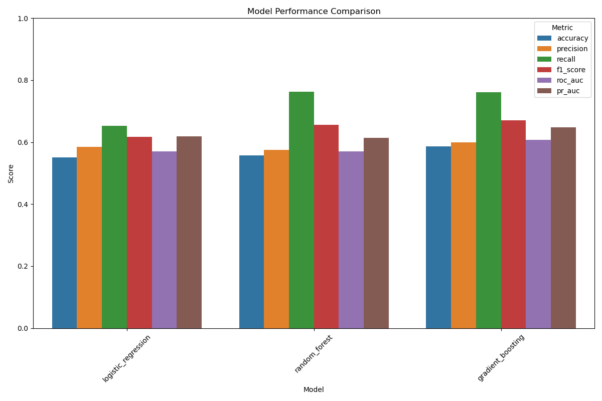

## Detailed Model Analysis

### 1. Logistic Regression

- **Accuracy**: 54.39%
- **Precision**: 57.84%
- **Recall**: 62.99%
- **F1 Score**: 60.31%
- **ROC AUC**: 56.33%
- **PR AUC**: 61.30%

**Confusion Matrix**:
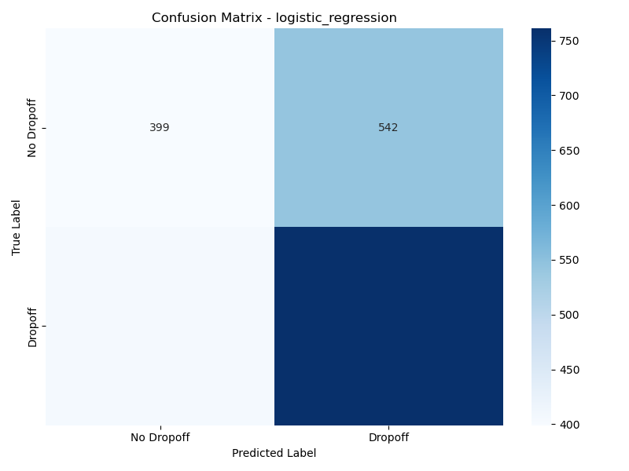

**Interpretation**: The logistic regression model provides a baseline performance with balanced precision and recall. It correctly identifies about 63% of actual drop-offs (recall) but has a moderate false positive rate.

### 2. Random Forest (Best Model)

- **Accuracy**: 56.43%
- **Precision**: 58.08%
- **Recall**: 74.72%
- **F1 Score**: 65.36%
- **ROC AUC**: 58.31%
- **PR AUC**: 63.01%

**Confusion Matrix**:
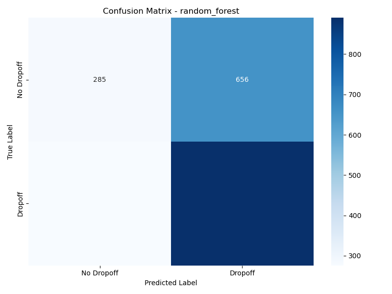

**Feature Importance**:
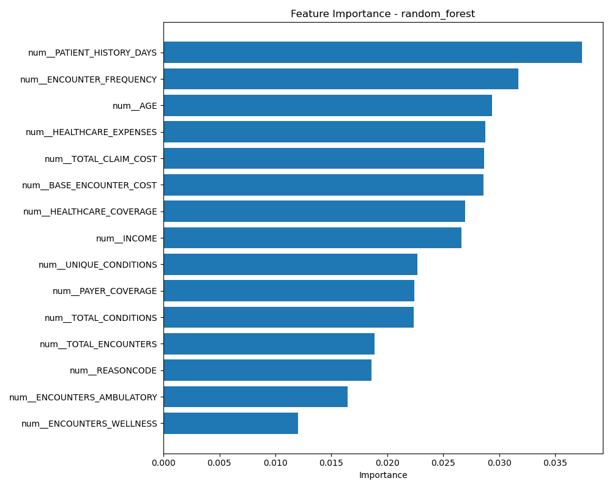

**Interpretation**: The Random Forest model achieves the best overall performance with the highest ROC AUC score (58.31%). It excels at identifying true drop-offs with a high recall of 74.72%, making it particularly valuable for healthcare providers who want to minimize missed interventions. The model's feature importance graph shows which patient characteristics are most predictive of drop-offs.

### 3. Gradient Boosting

- **Accuracy**: 56.19%
- **Precision**: 58.85%
- **Recall**: 67.73%
- **F1 Score**: 62.98%
- **ROC AUC**: 58.28%
- **PR AUC**: 63.47%

**Confusion Matrix**:
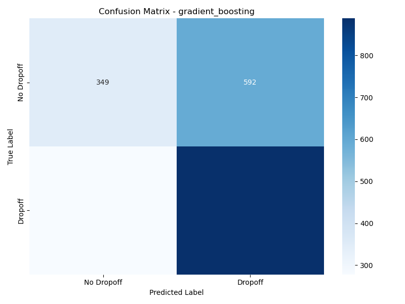

**Feature Importance**:
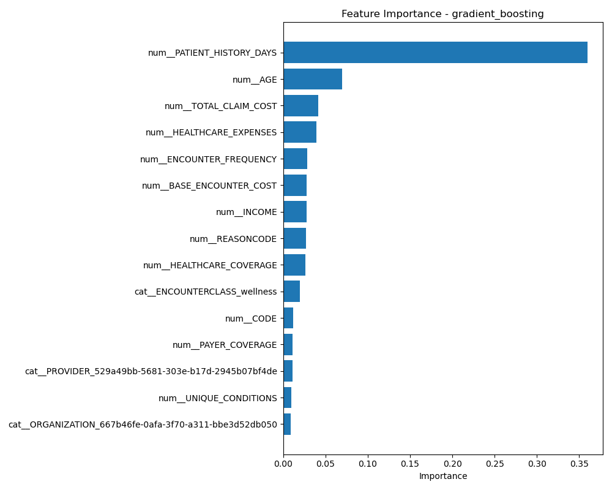

**Interpretation**: The Gradient Boosting model achieves the highest precision (58.85%) and PR AUC (63.47%) among all models, making it slightly more reliable when it predicts a drop-off. It has a good balance between precision and recall, with slightly fewer false positives than the Random Forest model.

### 4. Deep Learning (TensorFlow)

- **Accuracy**: 54.86%
- **Precision**: 56.74%
- **Recall**: 75.50%
- **F1 Score**: 64.79%
- **ROC AUC**: 55.61%
- **PR AUC**: 61.57%

**Interpretation**: The Deep Learning model achieves the highest recall (75.50%) of all models, meaning it identifies the most true drop-offs. However, it has the lowest precision, indicating more false positives. This model would be useful when the cost of missing a potential drop-off is high and follow-up interventions are relatively inexpensive.

## Metric Comparisons

### Accuracy Comparison
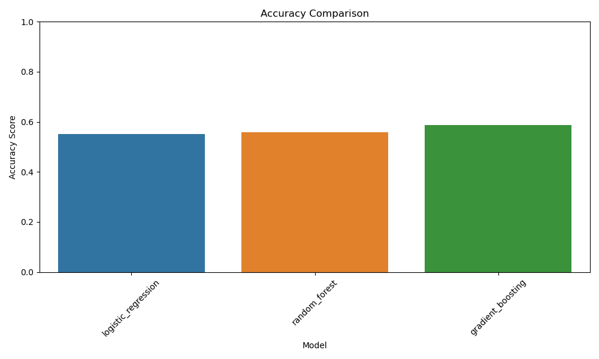

### Precision Comparison
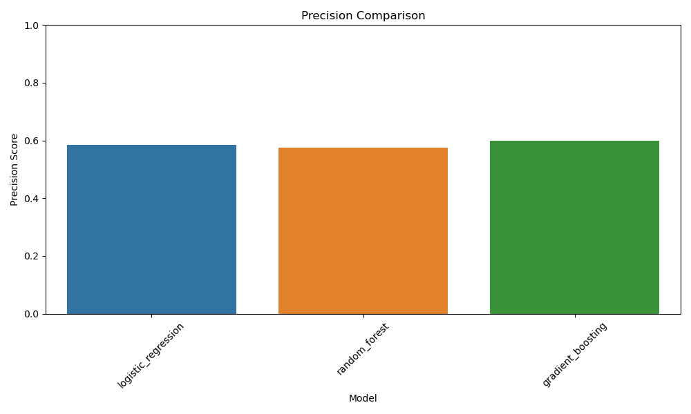

### Recall Comparison
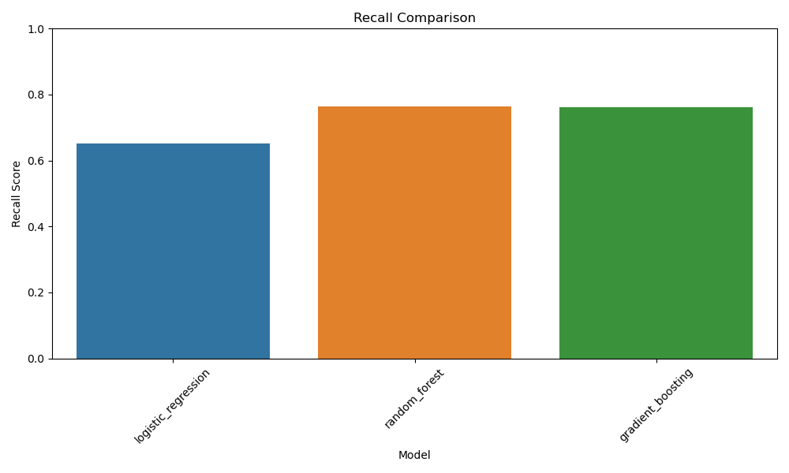

### F1 Score Comparison
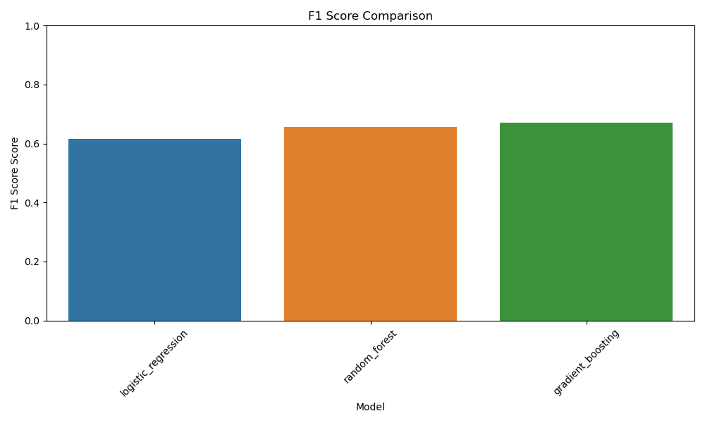

### ROC AUC Comparison
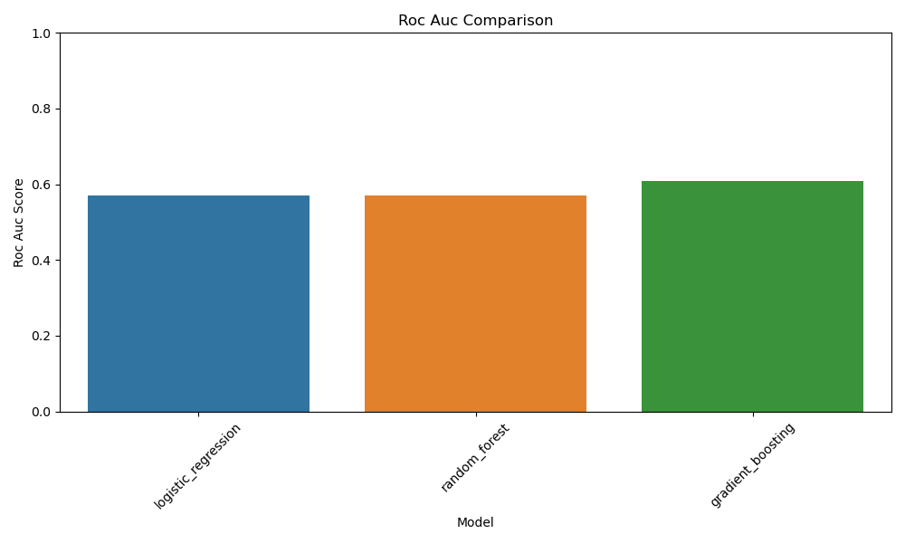

### PR AUC Comparison
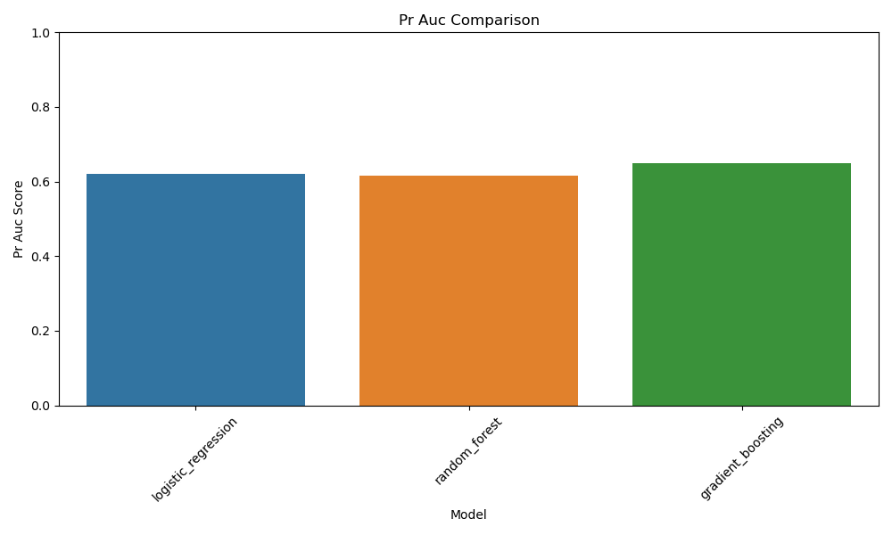

## Key Findings

1. **High Drop-off Rate**: The dataset shows a 55.03% drop-off rate, indicating that more than half of patients discontinue healthcare services.

2. **Model Performance**: All models perform better than random chance (50%) but show moderate predictive power, with ROC AUC scores ranging from 55.61% to 58.31%.

3. **Recall vs. Precision Trade-off**: The models show a clear trade-off between recall and precision. Random Forest and Deep Learning models have high recall but lower precision, while Gradient Boosting offers a more balanced approach.

4. **Best Overall Model**: The Random Forest model provides the best overall performance with the highest ROC AUC score and a good balance of metrics.

## Clinical Implications

1. **Early Intervention**: The high recall of the Random Forest model (74.72%) allows healthcare providers to identify a large proportion of patients at risk of dropping off, enabling early intervention.

2. **Resource Allocation**: The precision of around 58% across models suggests that interventions would be directed at some patients who would not actually drop off. Healthcare systems should consider the cost-effectiveness of interventions.

3. **Personalized Approach**: Feature importance graphs from the Random Forest and Gradient Boosting models highlight patient characteristics most associated with drop-offs, allowing for more targeted and personalized interventions.

## Recommendations

1. **Model Selection**: Use the Random Forest model for general drop-off prediction due to its balanced performance and interpretability.

2. **High-Risk Scenarios**: In scenarios where missing a potential drop-off has high consequences, consider using the Deep Learning model with its superior recall.

3. **Feature Engineering**: Focus on improving the model by incorporating additional features related to the most important predictors identified in the feature importance graphs.

4. **Ensemble Approach**: Consider an ensemble approach that combines predictions from multiple models to improve overall performance.

5. **Continuous Monitoring**: Implement a system to continuously monitor and update the model as new patient data becomes available.

## Conclusion

The patient drop-off analysis provides valuable insights into predicting which patients are likely to discontinue healthcare services. While the models show moderate predictive power, they offer significant improvements over random chance and can be valuable tools for healthcare providers in identifying at-risk patients and implementing targeted interventions.

The Random Forest model emerges as the best overall model, with a good balance of performance metrics and interpretability. The analysis demonstrates the potential of machine learning approaches in addressing the challenge of patient drop-offs in healthcare settings.
